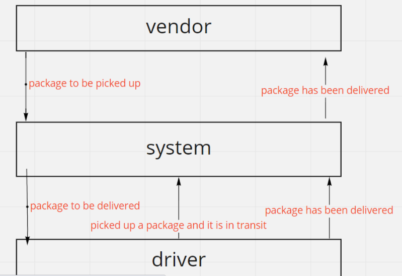

# CAPS

**auhtor** : mostafajdeitawi
[PR]()

## **Setup**
        * .env requirements
          * STORE_NAME
        * faker 
        * uuid

## **Running the app**

            npm start

**UmlDiagram** : 

